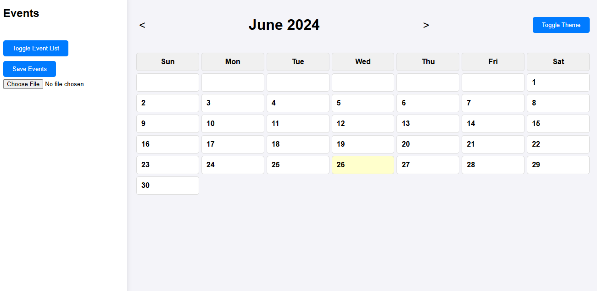
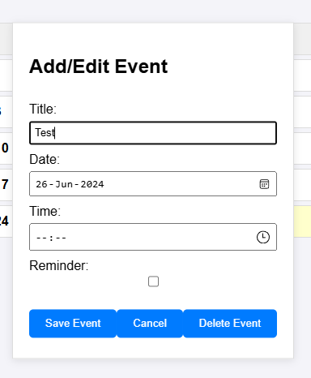
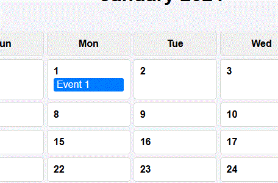

# Calendar-App
This is a simple calendar application that allows users to add, edit, and delete events. The app features a monthly view of the calendar, an event list, and the ability to save and load events.

# Features
- View a monthly calendar with days highlighted.
- Add, edit, and delete events.
- Drag and drop events to change their date.
- Save events to local storage and load them from a file.
- Toggle between light and dark themes.
- Highlight today's date.

# Files
 - index.html: The main HTML file that contains the structure of the calendar and event dialog.
 - styles.css: The CSS file that styles the calendar and its elements.
 - script.js: The JavaScript file that handles the logic and interactivity of the calendar.

# Usage
1. Open the calendar in your web browser.
2. Navigate through months using the arrow buttons.
3. Click on a day to add or edit an event.
4. Drag and drop events to change their date.
5. Toggle the event list visibility with the "Toggle Event List" button.
6. Save the events to a file with the "Save Events" button.
7. Load events from a file using the "Load Events" input.
8. Toggle between light and dark themes using the "Toggle Theme" button.

# Code Overview
## HTML
The index.html file contains the structure of the calendar application. It includes:

- A sidebar for the event list and buttons to toggle the event list and save/load events.
- A calendar container with navigation buttons to switch months and a button to toggle the theme.
- A dialog form for adding and editing events.

## CSS
The styles.css file contains the styling for the application, including:

- General styles for the body, sidebar, and calendar container.
- Styles for the calendar grid, days, and event items.
- Dark theme styles.
- Styles for the event dialog form.

## JavaScript
The script.js file contains the logic for the application, including:

- Rendering the calendar and event list.
- Handling event addition, editing, and deletion.
- Drag-and-drop functionality for events.
- Saving and loading events from local storage and files.
- Toggling between light and dark themes.

# Conclusion
The Calendar App offers a straightforward solution for managing events, storing them securely in a TXT file format. This lightweight application allows users to add, edit, and delete events directly from the calendar interface. With intuitive drag-and-drop functionality and customizable theme options, the app aims to streamline scheduling tasks efficiently.
